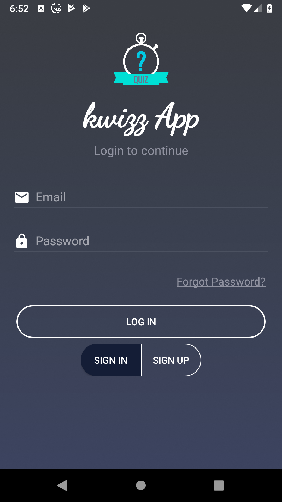
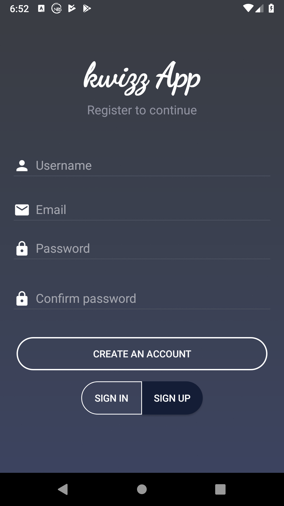
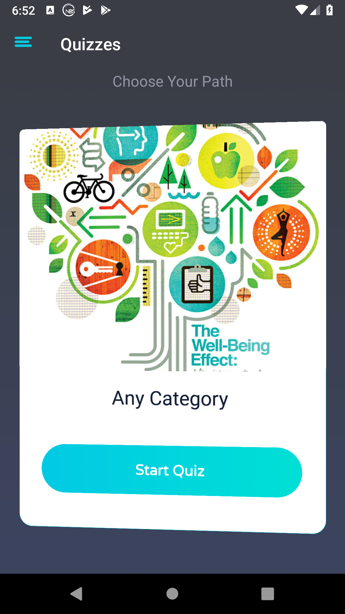
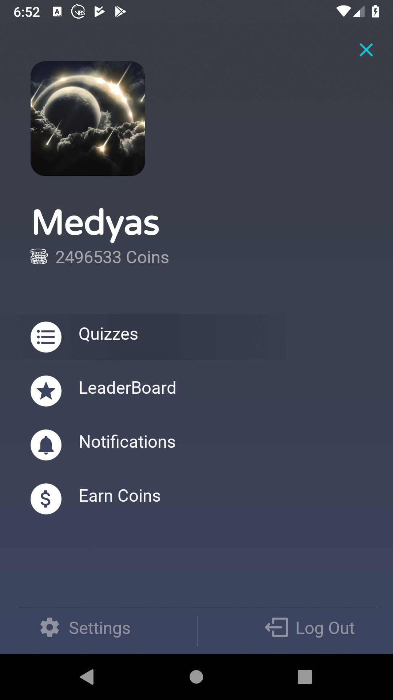
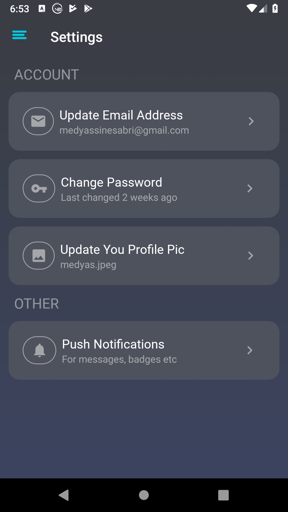
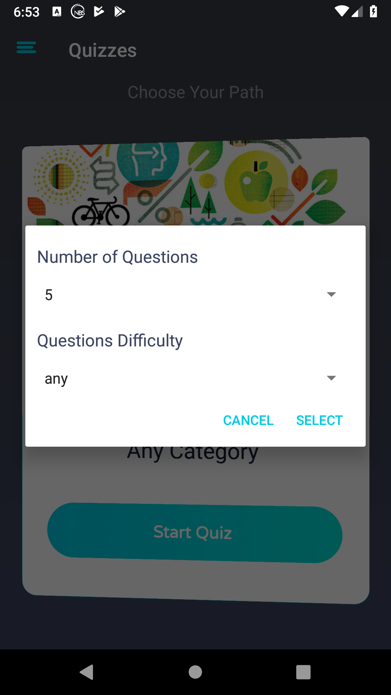
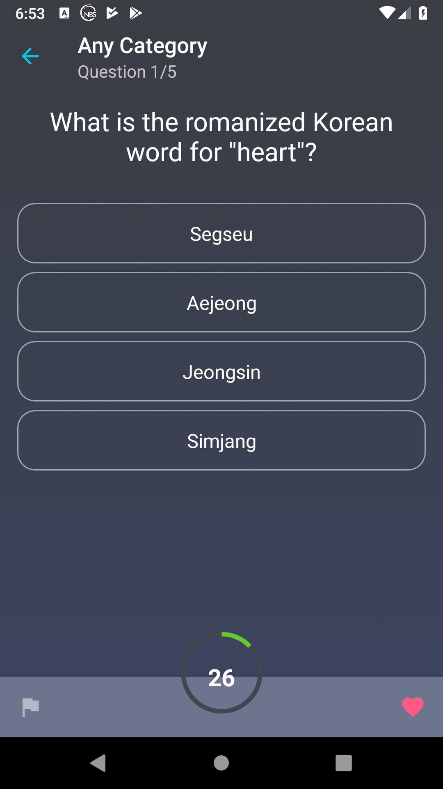
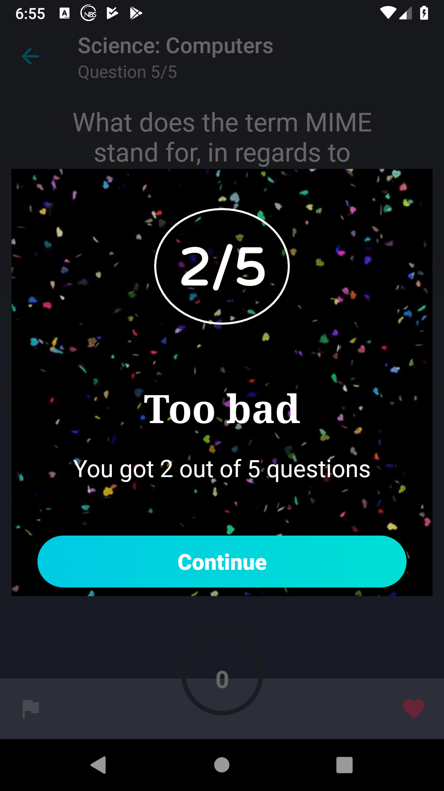

# Kwizz App

## Project Overview

Part of my master's degree, I developed a quiz app which will offer you a multiple choice questions and 30 seconds to answer each of them.

## App Description

A quiz app that uses Retrofit to fetch the questions from the OpenDB API http://opentdb.com/  based on user selection of category, difficulty and number of questions. The app authenticate the users using Firebase Auth and saves thier data. We use fireStore DB to store user unlocked categories and RealTime DB for coin counts. The user can modify his/her information including adding a profile picture which is then stored in the firebase storage.
The app has a LeaderBoard Fragment that displays a static data with random generated scores.
Also, the app uses Butterknife to bind all the views.

## Screenshots

**Sign  in interface**  
 

**Sign up interface**  
  

** Dashboard displaying a list of categories**  
  

**locked Quiz category that require paying coins to unlock**  

**Navigation menu**  
  

** LeaderBoard List**  
  

**Settings interface**  
  

**Selecting number of question and difficulty**  
  

** Quiz question with the choices and timer**  
  

**Congrats interface after finishing all the questions**  
    

## License

MIT License

Copyright (c) 2018 medyas

Permission is hereby granted, free of charge, to any person obtaining a copy
of this software and associated documentation files (the "Software"), to deal
in the Software without restriction, including without limitation the rights
to use, copy, modify, merge, publish, distribute, sublicense, and/or sell
copies of the Software, and to permit persons to whom the Software is
furnished to do so, subject to the following conditions:

The above copyright notice and this permission notice shall be included in all
copies or substantial portions of the Software.

THE SOFTWARE IS PROVIDED "AS IS", WITHOUT WARRANTY OF ANY KIND, EXPRESS OR
IMPLIED, INCLUDING BUT NOT LIMITED TO THE WARRANTIES OF MERCHANTABILITY,
FITNESS FOR A PARTICULAR PURPOSE AND NONINFRINGEMENT. IN NO EVENT SHALL THE
AUTHORS OR COPYRIGHT HOLDERS BE LIABLE FOR ANY CLAIM, DAMAGES OR OTHER
LIABILITY, WHETHER IN AN ACTION OF CONTRACT, TORT OR OTHERWISE, ARISING FROM,
OUT OF OR IN CONNECTION WITH THE SOFTWARE OR THE USE OR OTHER DEALINGS IN THE
SOFTWARE.